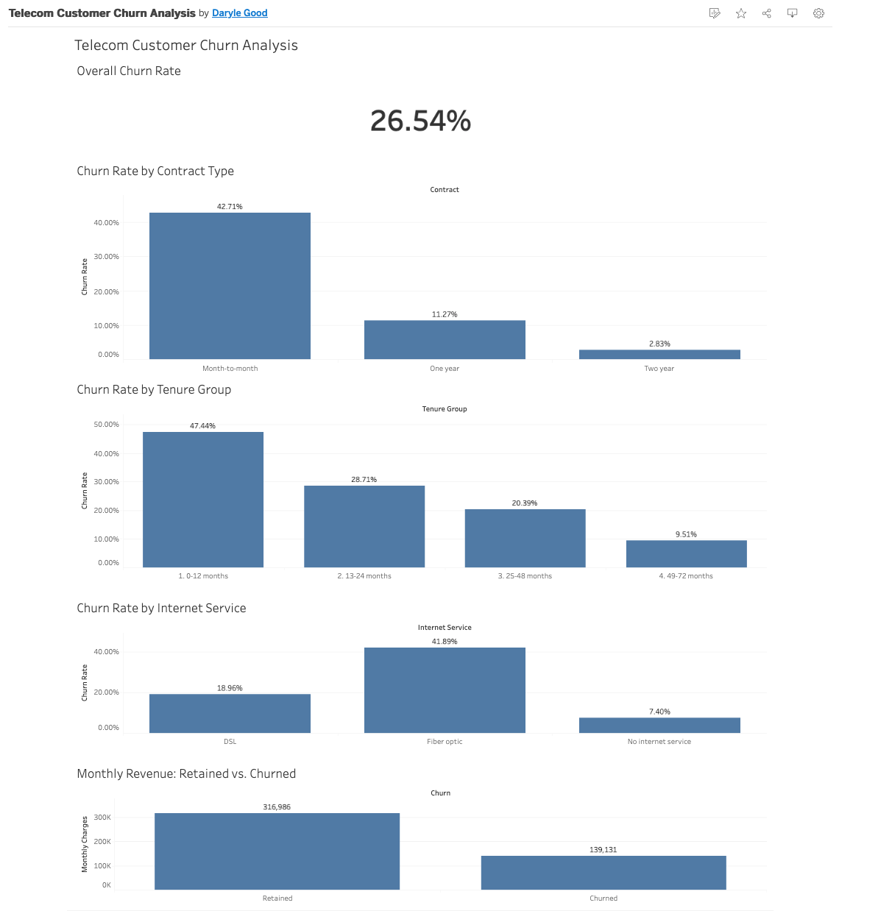
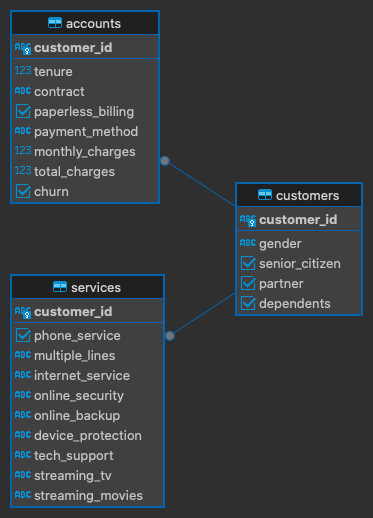

# Telecom Customer Churn Analysis (SQL + Tableau)

An end-to-end analysis of customer churn for a telecom company, built with PostgreSQL and Tableau Public. The project loads and cleans raw data, designs a three-table relational schema, answers ten business questions in SQL (including CTEs and window functions), and presents the results in an interactive dashboard.

**Live dashboard:** https://public.tableau.com/views/TelecomCustomerChurnAnalysis_17914270502100/TelecomChurnDashboard



## Key findings

Overall, **26.54%** of customers churned (1,869 of 7,043).

| Finding | Result |
|---|---|
| Contract type | Month-to-month customers churn at **42.71%**, versus 11.27% on one-year and **2.83%** on two-year contracts |
| Internet service | Fiber optic customers churn at **41.89%**, more than double the DSL rate of 18.96%; customers with no internet churn at 7.40% |
| Tenure | Churn falls steadily with tenure, from **47.44%** in the first 12 months to **9.51%** after 48 months |
| Payment method | Electronic check is the only method above the overall average, at **45.29%** |
| Add-on services | Among internet customers, those with neither online security nor tech support churn at **48.96%**; those with both churn at **9.01%** |
| Revenue impact | Churned customers were 26.54% of customers but **30.50%** of monthly revenue ($139,130.85 of $456,116.60), because they paid more on average ($74.44 vs. $61.27) |
| At-risk segment | **622** active customers are month-to-month, have internet with no security or tech support, and pay above-average bills, representing **$52,237.45** in monthly revenue |

These are associations in the data, not proof of cause. For example, customers who buy security and support add-ons may simply be more committed customers to begin with.

## Tools

- **PostgreSQL 18** (via Postgres.app) for the database
- **DBeaver Community** for writing and running SQL
- **Tableau Public** (web authoring) for the dashboard
- **Dataset:** [Telco Customer Churn](https://www.kaggle.com/datasets/blastchar/telco-customer-churn) on Kaggle (7,043 customers, 21 columns). The data files are © their original authors, so this repository does not include them. Download them from Kaggle to reproduce the work.

## Project structure

```
telecom-churn-sql/
├── data/                            # empty in the repo; see "How to reproduce"
├── sql/
│   ├── 00_create_raw_table.sql      # staging table, all columns TEXT
│   ├── 01_clean_data.sql            # typed, cleaned table
│   ├── 02_create_schema.sql         # customers / services / accounts
│   ├── 03_populate_tables.sql       # loads the three tables
│   ├── 04_analysis_queries.sql      # the 10 analysis queries
│   └── 05_dashboard_export.sql      # flat query exported for Tableau
└── images/
    ├── schema_diagram.png
    └── dashboard_screenshot.png
```

## Data cleaning

The raw CSV is loaded into a staging table with every column as `TEXT`, so the import never fails on bad values. Cleaning then happens in SQL (`01_clean_data.sql`).

Profiling checks before cleaning:

- **Duplicates:** none. All 7,043 `customer_id` values are unique.
- **Category values:** `churn`, `contract`, `internet_service`, `multiple_lines` and `payment_method` have no typos, casing differences or blanks.
- **`total_charges`:** 11 rows contain a blank value instead of a number. All 11 have `tenure = 0` and `churn = No`, meaning they are new customers who have not been billed yet.

Decision: keep all 11 rows and convert the blank `total_charges` to `NULL` rather than 0. `NULL` correctly means "no bill yet," keeps these customers in the 7,043 count, and prevents fake zeros from distorting averages.

Other cleaning steps: `Yes`/`No` columns converted to booleans, `tenure` cast to integer, charges cast to numeric, and `customer_id` set as the primary key.

## Schema

The cleaned data is split into three tables by subject area. Each customer has exactly one row in each table, linked by `customer_id`.



| Table | Holds |
|---|---|
| `customers` | Demographics: gender, senior citizen, partner, dependents |
| `services` | Subscribed services: phone, internet, security, backup, support, streaming |
| `accounts` | Billing and outcome: tenure, contract, payment method, charges, churn |

## Analysis queries

All ten queries are in `sql/04_analysis_queries.sql`.

| # | Business question | SQL skills |
|---|---|---|
| 1 | What is the overall churn rate? | Aggregation, `FILTER` |
| 2 | How does churn differ by contract type? | `JOIN`, `GROUP BY` |
| 3 | How does churn differ by internet service? | Multi-table join |
| 4 | How much monthly revenue is lost to churn? | Conditional aggregation |
| 5 | Which payment methods churn above the average? | `HAVING`, subquery |
| 6 | Do security and tech support reduce churn? | `CASE`, three-table join |
| 7 | Which tenure groups churn the most? | `CASE` bucketing |
| 8 | Which active, high-spending customers show the main risk signals? | CTE |
| 9 | Who are the top spenders within each contract type? | Window function (`RANK`) |
| 10 | How does each tenure cohort compare to the overall rate? | CTE, window functions (`SUM() OVER`, `LAG`) |

## How to reproduce

1. Install PostgreSQL and create a database: `CREATE DATABASE telco_churn;`
2. Download the dataset from Kaggle (link above) and save it as `data/telco_churn_raw.csv`. The `data` folder is not tracked in this repository.
3. Run `sql/00_create_raw_table.sql`.
4. Load the CSV into `raw_telco_churn`. In `psql`:
   ```
   \copy raw_telco_churn FROM 'data/telco_churn_raw.csv' WITH (FORMAT csv, HEADER true)
   ```
5. Run the remaining scripts in order: `01` through `04`.
6. Verify: `SELECT COUNT(*) FROM accounts;` should return 7043.
7. (Optional) To rebuild the dashboard data, run `sql/05_dashboard_export.sql`, export the result as CSV, and upload it to Tableau Public.

## Limitations

- The dataset is a static snapshot, so the analysis cannot show how churn changes over time.
- Findings are correlations. They identify where churn concentrates, not why customers leave.
- The dashboard is built from a CSV extract of the query results, not a live database connection.

## Author

Daryle Good
linkedin.com/in/darylegood
